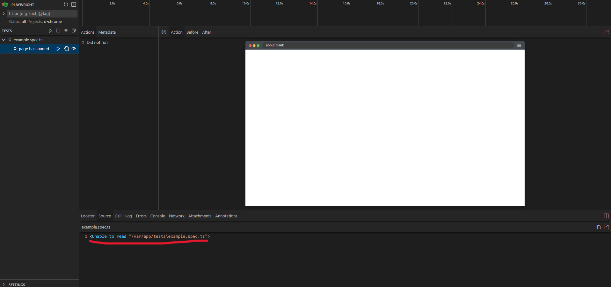

# Playwright UI Mode with Docker

> [!Note] 
>
> This is was created to replicate an issue I encountered when using Playwright UI mode with Docker

## Testing locally

Clone the repo

```bash
git clone https://github.com/nickrph/docker-pw-ui.git
```

Install dependencies

```bash
npm i
```

Build the docker image and run Playwright UI mode. I'm using a Dockerfile to build the Docker image.

```bash
npm run docker:build
npm run docker:test:ui
```

## Issue summary

After running the scripts above, Playwright UI mode is accessible in port 8080.



The main issue is that the page is blank and the path to the test file seems to be not proper.

```bash
<Unable to read "/var/app/tests\example.spec.ts">
```

> [!Note]
>
> Running tests without UI mode seem to work fine and I was able to generate screenshots.
